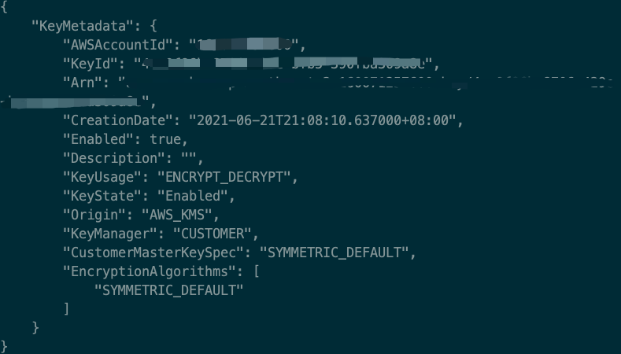
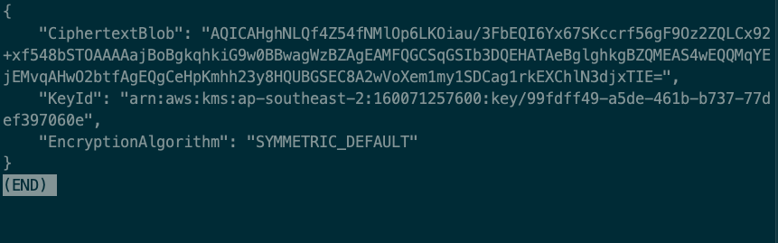
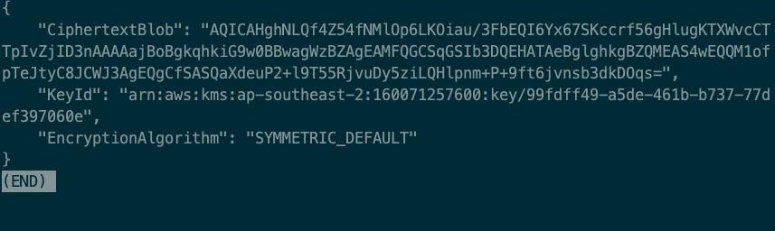
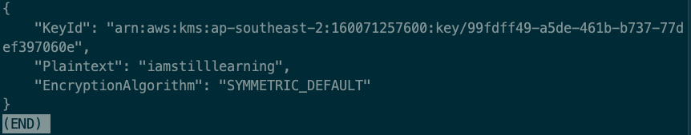

1)创建对称加密的 KMS key
aws kms create-key --profile tw-aws-beach --region ap-southeast-2
    

2)加密一段字符串
aws kms encrypt  --key-id 99fdff49-a5de-461b-b737-77def397060e --plaintext 'i am still learning' --profile tw-aws-beach --region ap-southeast-2
    

3)使用同一个 Key 重新加密同一段字符串，观察结果
输出结果不同
    

4)将加密后的字符串进行解密
aws kms decrypt \
    --ciphertext-blob "AQICAHghNLQf4Z54fNMlOp6LKOiau/3FbEQI6Yx67SKccrf56gEku1g08p96hlnsD6EXmlXwAAAAajBoBgkqhkiG9w0BBwagWzBZAgEAMFQGCSqGSIb3DQEHATAeBglghkgBZQMEAS4wEQQMKnayN4jSZ8Phl1x5AgEQgCffJDdB9HsiguxRWRk8de/hXCa5WYPAbj0Nmc8260yVL5nqol3nAAI=" \
    --key-id 99fdff49-a5de-461b-b737-77def397060e \
    --profile tw-aws-beach --region ap-southeast-2

    